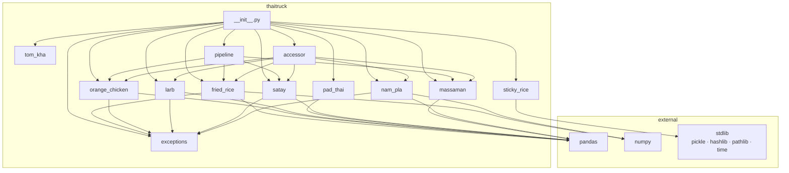
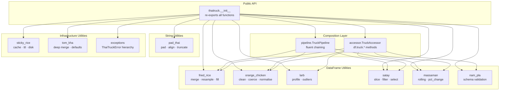
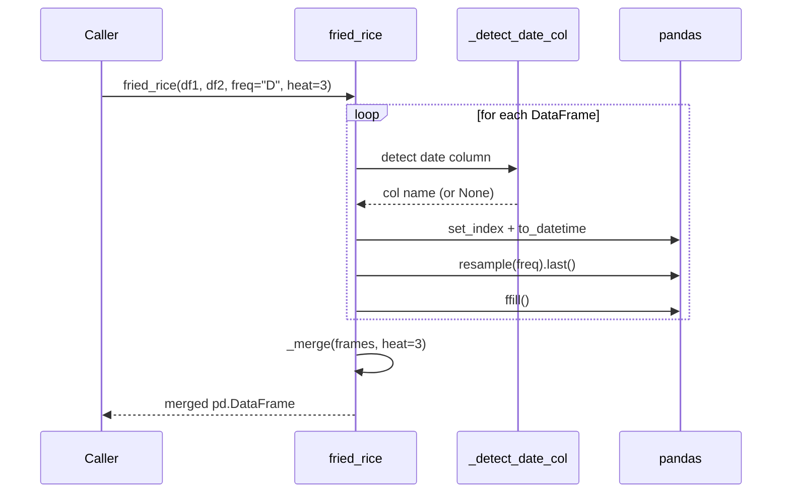
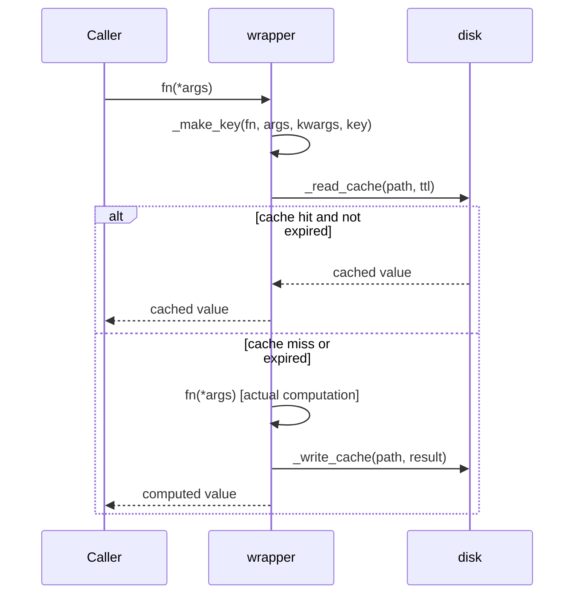

# ThaiTruck — Architecture

## Project Type

Pure Python library. No framework, no server, no CLI. Distributed as a PyPI
wheel. Consumers `import` individual modules directly.

---

## Repository Layout

```
ThaiTruck/
├── pyproject.toml              # build config, metadata, dependencies
├── README.md
├── ARCHITECTURE.md
├── src/
│   └── thaitruck/
│       ├── __init__.py         # public re-exports + __version__
│       ├── fried_rice.py       # time-series DataFrame merger
│       ├── orange_chicken.py   # DataFrame normalization / cleaning
│       ├── larb.py             # statistical profiling
│       ├── pad_thai.py         # string padding / alignment
│       ├── sticky_rice.py      # persistent disk cache
│       ├── satay.py            # expressive DataFrame slicing
│       ├── tom_kha.py          # deep config dict merging
│       ├── massaman.py         # rolling aggregations and percentage change
│       ├── nam_pla.py          # schema validation
│       ├── exceptions.py       # ThaiTruckError hierarchy (shared leaf module)
│       ├── pipeline.py         # TruckPipeline fluent wrapper (composition layer)
│       └── accessor.py         # registers the `.truck` pandas accessor (composition layer)
└── tests/
    ├── test_fried_rice.py
    ├── test_orange_chicken.py
    ├── test_larb.py
    ├── test_pad_thai.py
    ├── test_sticky_rice.py
    ├── test_satay.py
    ├── test_tom_kha.py
    ├── test_massaman.py
    ├── test_nam_pla.py
    ├── test_exceptions.py
    ├── test_pipeline.py
    └── test_accessor.py
```

---

## Module Dependency Map

The 9 utility modules (`fried_rice`, `orange_chicken`, `larb`, `pad_thai`,
`sticky_rice`, `satay`, `tom_kha`, `massaman`, `nam_pla`) are **independent of
each other** — none imports another utility module. All external dependencies
flow in from `pandas` and `numpy` only. `sticky_rice` and `tom_kha` use stdlib
only.

Two exceptions to "independent," both intentional:

- **`exceptions`** is a shared, dependency-free leaf module. `fried_rice`,
  `orange_chicken`, `larb`, `satay`, and `nam_pla` import it for their error
  types. This doesn't break utility-module independence — none of them import
  *each other*, they all import the same leaf.
- **`pipeline`** and **`accessor`** are a composition layer, not utility
  modules. Like `__init__.py`, their entire job is to call the utility
  modules, so they depend on several of them by design.



---

## Architectural Layers

ThaiTruck has two layers: a flat collection of independent utility functions,
and a thin composition layer on top of them. There is no domain model, no
service layer, and no persistence layer. The architecture is intentionally
minimal.



---

## Public API Surface

Every function is exported from `thaitruck.__init__` and callable at the
top level after `from thaitruck import <name>`.

### `fried_rice`

```python
def fried_rice(
    *dfs: pd.DataFrame,
    freq: str = "D",
    heat: int = 3,
    join: str = "outer",       # "outer" | "inner" | "left"
    fuzzy_columns: bool = False,
    fill_method: str = "ffill",
    date_col: str | list[str] | None = None,
    suffix_template: str | None = None,   # e.g. "_src{i}"; defaults to "_{i}"
) -> pd.DataFrame
```

Internal helpers (not public):
- `_detect_date_col(df)` — name-hint + dtype heuristic
- `_normalize(name)` — fuzzy column name normalisation
- `_reindex_frames(frames, join)` — computes the `join`-based target index and reindexes all frames to it before merging
- `_merge(frames, heat, suffix_template=None)` — heat-dispatched merge strategy

Timezone-aware indices are stripped to naive via `tz_localize(None)`
immediately after date detection.

### `orange_chicken`

```python
def orange_chicken(
    df: pd.DataFrame,
    heat: int = 3,
    *,
    rename: dict | None = None,
    dtypes: dict | None = None,
) -> pd.DataFrame
```

`rename` is applied after the heat-level cleaning steps; `dtypes` (`.astype()`)
is applied last, so its keys refer to post-`rename` column names.

Internal helpers (not public):
- `_clean_col_name(name)` — lowercase, underscores, strip specials
- `_strip_strings(df)` — strip cell whitespace
- `_coerce_numeric(df)` — numeric string coercion (≥50% success threshold)
- `_coerce_booleans(df)` — boolean string resolution (≥90% coverage threshold)
- `_drop_sparse(df, threshold)` — drop columns at or above null fraction

### `larb`

```python
def larb(
    df: pd.DataFrame,
    heat: int = 3,
    *,
    include: list[str] | None = None,
    exclude: list[str] | None = None,
) -> pd.DataFrame
```

Returns a profile DataFrame indexed by column name. Numeric columns get
full stats + IQR outlier fences. Non-numeric columns get cardinality stats.
`include` restricts to those columns (order from `df.columns`, not `include`);
`exclude` is applied after `include`.

Heat → IQR multiplier mapping: `{1: 3.0, 2: 2.5, 3: 2.0, 4: 1.5, 5: 1.0}`

### `pad_thai`

```python
def pad_thai(
    value: str | list | pd.Series,
    width: int,
    align: str = "left",       # "left" | "right" | "center"
    fill: str = " ",
    truncate: bool = False,
) -> str | list | pd.Series    # mirrors input type
```

### `sticky_rice`

```python
# Decorator factory (recommended)
@sticky_rice(ttl=3600, key=None, cache_dir=None, compress=False)
def my_fn(...): ...

# Bare decorator (no options)
@sticky_rice
def my_fn(...): ...
```

Decorated functions gain `.clear()`, `.cache_dir`, and `.stats()` (returns
`{"hits", "misses", "size_bytes"}`; counts are in-process only, not persisted).
Cache files are stored as `<md5_hash>.pkl` under `.thaitruck_cache/` by
default, gzip-compressed when `compress=True`.

### `satay`

```python
def satay(df: pd.DataFrame, *skewers: Any) -> pd.DataFrame

satay.head(df: pd.DataFrame, n: int = 5) -> pd.DataFrame
satay.tail(df: pd.DataFrame, n: int = 5) -> pd.DataFrame
```

Skewer dispatch table:

| Type | Effect |
|---|---|
| `str` | Column selector |
| `list[str]` | Multi-column selector |
| `slice` | Positional row slice via `iloc` |
| `tuple(col, lo, hi)` | Range row filter |
| `tuple(col, value, op)` | Comparison row filter (`op` in `> < >= <= == !=`); dispatched by the third element being a recognized operator string, else falls back to the range form above |
| `dict` | Equality / isin row filter |
| `callable` | Boolean mask row filter |

Column selectors are collected and applied last; all other skewers are
row filters applied left to right. `_COMPARISON_OPS` maps operator strings to
`operator` module functions.

### `tom_kha`

```python
def tom_kha(
    *configs: dict[str, Any],
    defaults: dict[str, Any] | None = None,
) -> dict[str, Any]
```

Merge strategy: `defaults` → `configs[0]` → `configs[1]` → … (last wins).
Nested dicts are merged recursively via `_deep_merge`. Lists and scalars are
overwritten, never appended.

### `massaman`

```python
def massaman(
    df: pd.DataFrame,
    column: str,
    *,
    window: int = 20,
    ops: list[str] | None = None,
) -> pd.DataFrame
```

Adds `{column}_roll_{op}_{window}` for windowed ops (`mean`, `std`, `sum`,
`min`, `max`, `median`) and `{column}_pct_change` for the non-windowed
`pct_change` op. Raises `KeyError` for a missing column, `ValueError` for an
unrecognized op.

### `nam_pla`

```python
def nam_pla(
    df: pd.DataFrame,
    spec: dict[str, dict[str, Any]],
    *,
    strict: bool = False,
) -> pd.DataFrame
```

Per-column constraint keys: `dtype`, `nullable`, `min`, `max`, `isin`,
`required`. Returns a `column`/`check`/`message` violations DataFrame (empty
when clean). `strict=True` raises `ValidationError` instead of just returning
the report. An unrecognized constraint key raises `ValueError` immediately.
`nam_prik` was folded into this module rather than built separately — same
spec shape, `strict=True` covers the fast-fail use case.

Internal helpers (not public):
- `_check_dtype(series, expected)` — dtype compatibility check
- `_DTYPE_CHECKS` — maps `float`/`int`/`str`/`bool` to a pandas dtype predicate

### `exceptions`

```python
class ThaiTruckError(Exception): ...
class DateColumnNotFound(ThaiTruckError, ValueError): ...
class InvalidHeatLevel(ThaiTruckError, ValueError): ...
class SkewTypeError(ThaiTruckError, TypeError): ...
class ValidationError(ThaiTruckError, ValueError): ...
```

Dependency-free leaf module. Each concrete exception also inherits the
built-in type it replaces, so existing `except ValueError` / `except
TypeError` call sites keep working.

### `pipeline.TruckPipeline`

```python
class TruckPipeline:
    def __init__(self, df: pd.DataFrame) -> None: ...
    def orange_chicken(self, heat: int = 3, *, rename=None, dtypes=None) -> "TruckPipeline": ...
    def fried_rice(self, *dfs, join: str = "outer", suffix_template=None, **kwargs) -> "TruckPipeline": ...
    def satay(self, *skewers) -> "TruckPipeline": ...
    def massaman(self, column: str, *, window: int = 20, ops=None) -> "TruckPipeline": ...
    def result(self) -> pd.DataFrame: ...
```

`fried_rice` and `orange_chicken` here list explicit parameters mirroring the
underlying function exactly (no `**kwargs` passthrough in the real code) — a
new parameter on the function requires a matching update in both `pipeline.py`
and `accessor.py`, or it silently isn't reachable through them.

Each chain method returns a new `TruckPipeline` wrapping the transformed
DataFrame; `.result()` unwraps it. `larb` is intentionally not a chain method
— it returns a profile, not a transformed version of the input.

### `accessor.TruckAccessor`

```python
@pd.api.extensions.register_dataframe_accessor("truck")
class TruckAccessor:
    def __init__(self, pandas_obj: pd.DataFrame) -> None: ...
    def orange_chicken(self, heat: int = 3, *, rename=None, dtypes=None) -> pd.DataFrame: ...
    def larb(self, heat: int = 3, *, include=None, exclude=None) -> pd.DataFrame: ...
    def satay(self, *skewers) -> pd.DataFrame: ...
    def fried_rice(self, *dfs, join: str = "outer", suffix_template=None, **kwargs) -> pd.DataFrame: ...
    def massaman(self, column: str, *, window: int = 20, ops=None) -> pd.DataFrame: ...
    def nam_pla(self, spec: dict, *, strict: bool = False) -> pd.DataFrame: ...
```

Registration happens as an import side effect in `thaitruck/__init__.py`
(`from thaitruck import accessor`). Thin delegation only — no separate logic.

---

## Shared Patterns

### The `heat` Parameter

`fried_rice`, `orange_chicken`, and `larb` all accept `heat: int` (1–5).
The semantics differ per module but the scale is consistent:

- **1** = most conservative / least aggressive
- **5** = most aggressive ("napalm")

This is a package-wide convention, not an enforced interface.

### Input / Output Types

DataFrame modules (`fried_rice`, `orange_chicken`, `larb`, `satay`, `massaman`)
always accept `pd.DataFrame` and always return `pd.DataFrame`. None mutate
their input — all operate on a `.copy()`. `nam_pla` also accepts a
`pd.DataFrame` but returns a violations report DataFrame rather than a
transformed version of the input (same shape of exception as `larb`).

`pad_thai` mirrors its input type: `str → str`, `list → list`,
`pd.Series → pd.Series`.

`tom_kha` is dict-in / dict-out. It never mutates input dicts.

`sticky_rice` is a decorator — it wraps any callable and preserves its
signature via `functools.wraps`.

---

## Data Flow: `fried_rice`



## Data Flow: `sticky_rice`



---

## Build & Publish

| Tool | Role |
|---|---|
| `hatchling` | Build backend (PEP 517) |
| `python -m build` | Produces `.tar.gz` + `.whl` in `dist/` |
| `twine upload dist/*` | Publishes to PyPI |

Version is declared once in `pyproject.toml` and mirrored in
`src/thaitruck/__init__.py` as `__version__`.

---

## Test Structure

One test file per module, mirroring the source layout. Tests use `pytest`
with class-based grouping. No mocking framework except `unittest.mock.patch`
in `test_sticky_rice.py` for time-based TTL testing.

```
tests/test_<module>.py  →  src/thaitruck/<module>.py
```

`test_accessor.py` imports `thaitruck` (not just the function under test) to
trigger accessor registration before asserting `df.truck` exists.

`sticky_rice` tests use `pytest`'s `tmp_path` fixture to isolate cache
files per test run — no `.thaitruck_cache/` pollution in the working directory.
