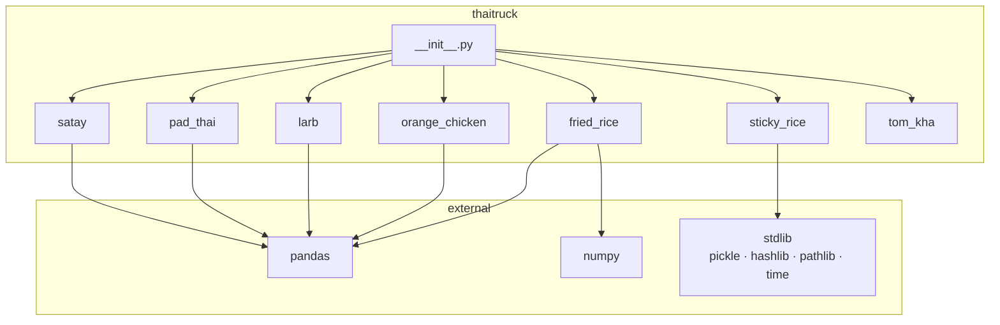
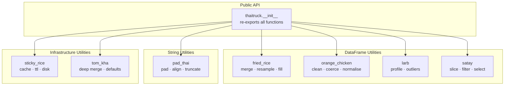
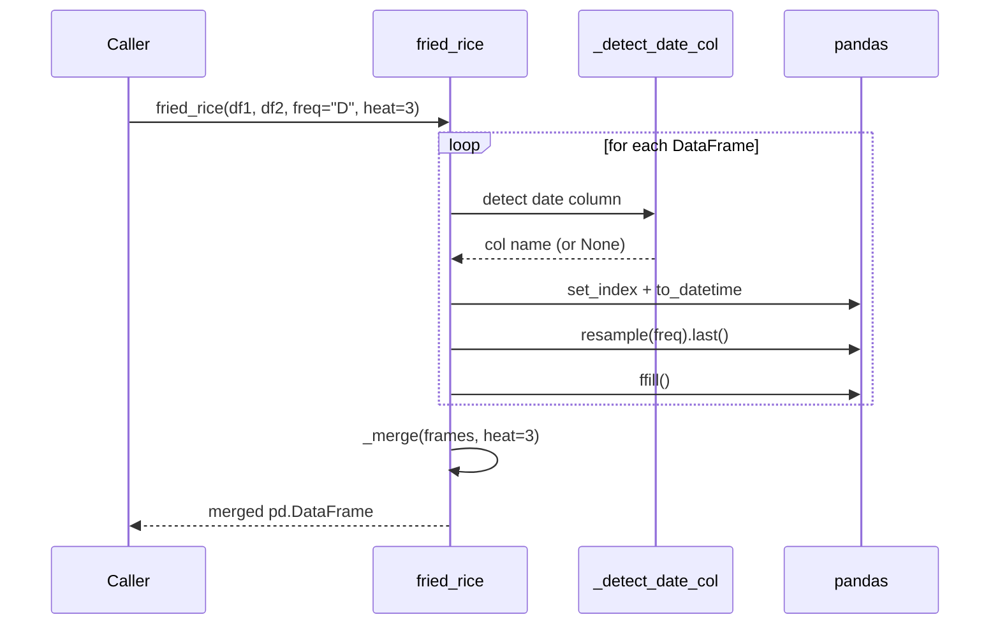
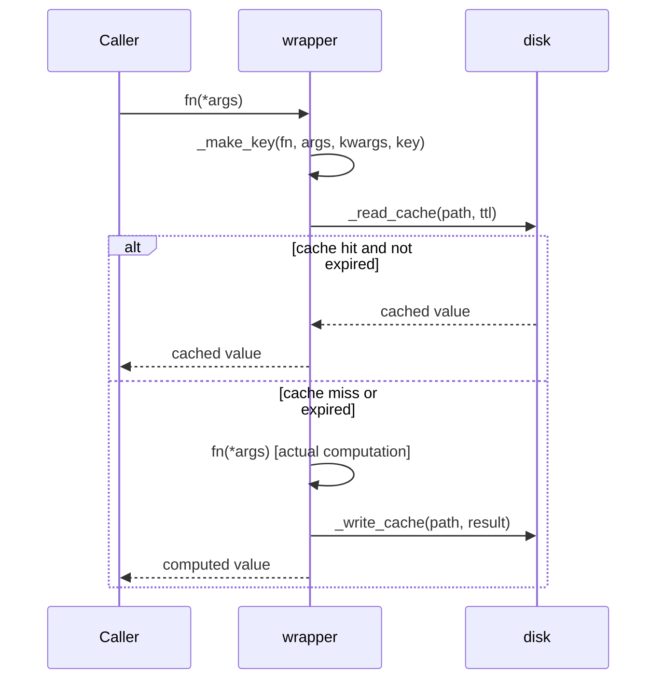

# ThaiTruck — Architecture

## Project Type

Pure Python library. No framework, no server, no CLI. Distributed as a PyPI
wheel. Consumers `import` individual modules directly.

---

## Repository Layout

```
ThaiTruck/
├── pyproject.toml              # build config, metadata, dependencies
├── README.md
├── ARCHITECTURE.md
├── src/
│   └── thaitruck/
│       ├── __init__.py         # public re-exports + __version__
│       ├── fried_rice.py       # time-series DataFrame merger
│       ├── orange_chicken.py   # DataFrame normalization / cleaning
│       ├── larb.py             # statistical profiling
│       ├── pad_thai.py         # string padding / alignment
│       ├── sticky_rice.py      # persistent disk cache
│       ├── satay.py            # expressive DataFrame slicing
│       └── tom_kha.py          # deep config dict merging
└── tests/
    ├── test_fried_rice.py
    ├── test_orange_chicken.py
    ├── test_larb.py
    ├── test_pad_thai.py
    ├── test_sticky_rice.py
    ├── test_satay.py
    └── test_tom_kha.py
```

---

## Module Dependency Map

All seven modules are **independent** — none imports from another. All
external dependencies flow in from `pandas` and `numpy` only. `sticky_rice`
uses stdlib only (`pickle`, `hashlib`, `pathlib`, `time`, `functools`).



---

## Architectural Layers

ThaiTruck has a single layer — a flat collection of independent utility
functions. There is no domain model, no service layer, and no persistence
layer. The architecture is intentionally minimal.



---

## Public API Surface

Every function is exported from `thaitruck.__init__` and callable at the
top level after `from thaitruck import <name>`.

### `fried_rice`

```python
def fried_rice(
    *dfs: pd.DataFrame,
    freq: str = "D",
    heat: int = 3,
    fuzzy_columns: bool = False,
    fill_method: str = "ffill",
    date_col: str | list[str] | None = None,
) -> pd.DataFrame
```

Internal helpers (not public):
- `_detect_date_col(df)` — name-hint + dtype heuristic
- `_normalize(name)` — fuzzy column name normalisation
- `_merge(frames, heat)` — heat-dispatched merge strategy

### `orange_chicken`

```python
def orange_chicken(df: pd.DataFrame, heat: int = 3) -> pd.DataFrame
```

Internal helpers (not public):
- `_clean_col_name(name)` — lowercase, underscores, strip specials
- `_strip_strings(df)` — strip cell whitespace
- `_coerce_numeric(df)` — numeric string coercion (≥50% success threshold)
- `_coerce_booleans(df)` — boolean string resolution (≥90% coverage threshold)
- `_drop_sparse(df, threshold)` — drop columns at or above null fraction

### `larb`

```python
def larb(df: pd.DataFrame, heat: int = 3) -> pd.DataFrame
```

Returns a profile DataFrame indexed by column name. Numeric columns get
full stats + IQR outlier fences. Non-numeric columns get cardinality stats.

Heat → IQR multiplier mapping: `{1: 3.0, 2: 2.5, 3: 2.0, 4: 1.5, 5: 1.0}`

### `pad_thai`

```python
def pad_thai(
    value: str | list | pd.Series,
    width: int,
    align: str = "left",       # "left" | "right" | "center"
    fill: str = " ",
    truncate: bool = False,
) -> str | list | pd.Series    # mirrors input type
```

### `sticky_rice`

```python
# Decorator factory (recommended)
@sticky_rice(ttl=3600, key=None, cache_dir=None)
def my_fn(...): ...

# Bare decorator (no options)
@sticky_rice
def my_fn(...): ...
```

Decorated functions gain a `.clear()` method and a `.cache_dir` attribute.
Cache files are stored as `<md5_hash>.pkl` under `.thaitruck_cache/` by default.

### `satay`

```python
def satay(df: pd.DataFrame, *skewers: Any) -> pd.DataFrame
```

Skewer dispatch table:

| Type | Effect |
|---|---|
| `str` | Column selector |
| `list[str]` | Multi-column selector |
| `slice` | Positional row slice via `iloc` |
| `tuple(col, lo, hi)` | Range row filter |
| `dict` | Equality / isin row filter |
| `callable` | Boolean mask row filter |

Column selectors are collected and applied last; all other skewers are
row filters applied left to right.

### `tom_kha`

```python
def tom_kha(
    *configs: dict[str, Any],
    defaults: dict[str, Any] | None = None,
) -> dict[str, Any]
```

Merge strategy: `defaults` → `configs[0]` → `configs[1]` → … (last wins).
Nested dicts are merged recursively via `_deep_merge`. Lists and scalars are
overwritten, never appended.

---

## Shared Patterns

### The `heat` Parameter

`fried_rice`, `orange_chicken`, and `larb` all accept `heat: int` (1–5).
The semantics differ per module but the scale is consistent:

- **1** = most conservative / least aggressive
- **5** = most aggressive ("napalm")

This is a package-wide convention, not an enforced interface.

### Input / Output Types

DataFrame modules (`fried_rice`, `orange_chicken`, `larb`, `satay`) always
accept `pd.DataFrame` and always return `pd.DataFrame`. None mutate their
input — all operate on a `.copy()`.

`pad_thai` mirrors its input type: `str → str`, `list → list`,
`pd.Series → pd.Series`.

`tom_kha` is dict-in / dict-out. It never mutates input dicts.

`sticky_rice` is a decorator — it wraps any callable and preserves its
signature via `functools.wraps`.

---

## Data Flow: `fried_rice`



## Data Flow: `sticky_rice`



---

## Build & Publish

| Tool | Role |
|---|---|
| `hatchling` | Build backend (PEP 517) |
| `python -m build` | Produces `.tar.gz` + `.whl` in `dist/` |
| `twine upload dist/*` | Publishes to PyPI |

Version is declared once in `pyproject.toml` and mirrored in
`src/thaitruck/__init__.py` as `__version__`.

---

## Test Structure

One test file per module, mirroring the source layout. Tests use `pytest`
with class-based grouping. No mocking framework except `unittest.mock.patch`
in `test_sticky_rice.py` for time-based TTL testing.

```
tests/test_<module>.py  →  src/thaitruck/<module>.py
```

`sticky_rice` tests use `pytest`'s `tmp_path` fixture to isolate cache
files per test run — no `.thaitruck_cache/` pollution in the working directory.
